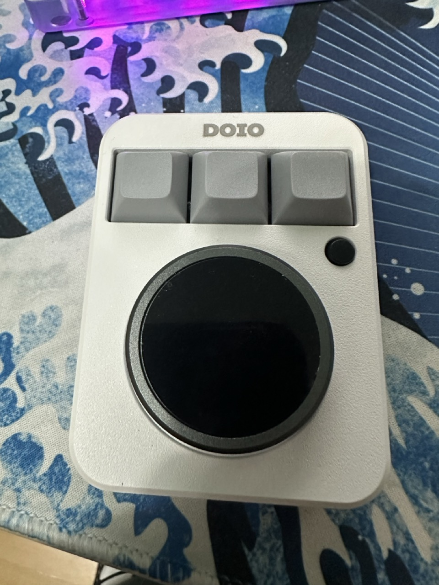
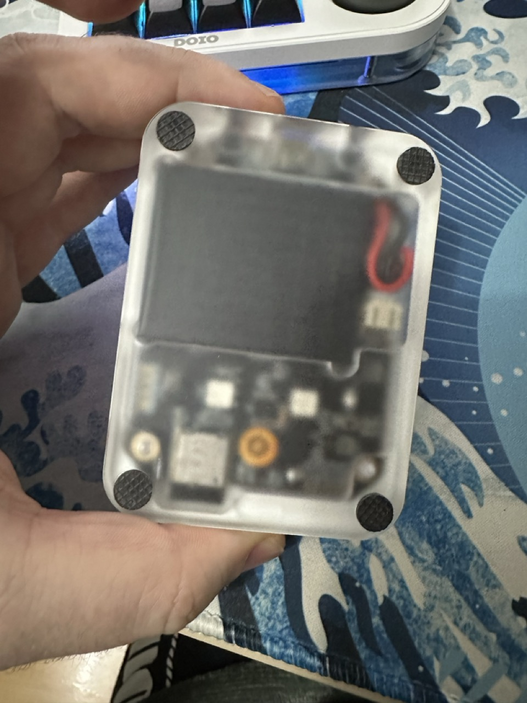

# Megalodon DOIO KB03B-01 Bluetooth

## Notes

- Only works with its own USB-A to USB-C cable.
- The VIA keymap JSON file is custom, to map the buttons correctly to this exact model.
- Need to use VIA 1.3.1 to map the keys.

<table>
  <tr>
  <td>
    
  </td>
  <td>
    
  </td>
  </tr>
</table>

## Files

<table>
  <tr>
  <th>File</th>
  <th>Description</th>
  </tr>
  <tr>
  <td>
    via-1.3.1--kb03-01-bluetooth-keymap.json
  </td>
  <td>
    VIA keymap sideloaded JSON file, use this to load up the keys for mapping. This is a custom-created file for this exact model.
  </td>
  </tr>
  <tr>
  <td>
    KB03B-01.pdf
  </td>
  <td>
    The presentation brochure from DOIO for this model.
  </td>
  </tr>
</table>
