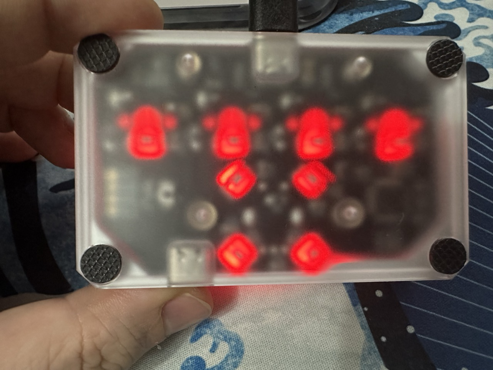

# Megalodon DOIO KB04-01

## Notes

- Only works with its own USB-A to USB-C cable.
- Need to use VIA 1.3.1 to map the keys.

<table>
  <tr>
  <td>
    
  </td>
  <td>
    
  </td>
  </tr>
</table>

## Files

<table>
  <tr>
  <th>File</th>
  <th>Description</th>
  </tr>
  <tr>
  <td>
    via-1.3.1--kb04-01-keymap.json
  </td>
  <td>
    VIA keymap sideloaded JSON file, use this to load up the keys for mapping.
  </td>
  </tr>
</table>
