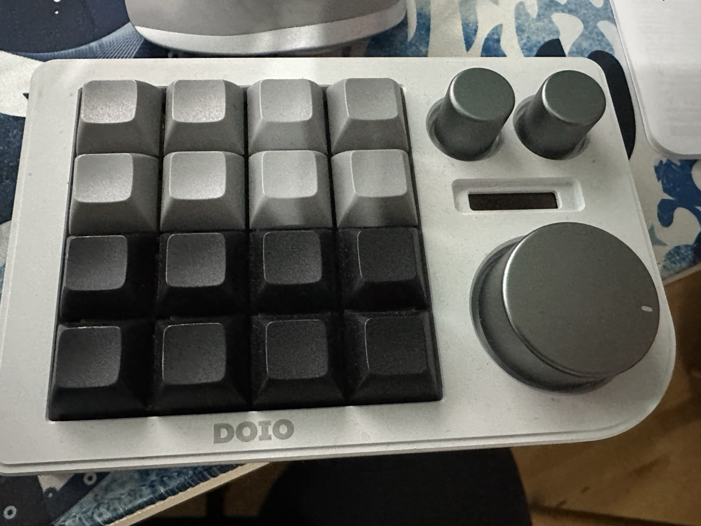
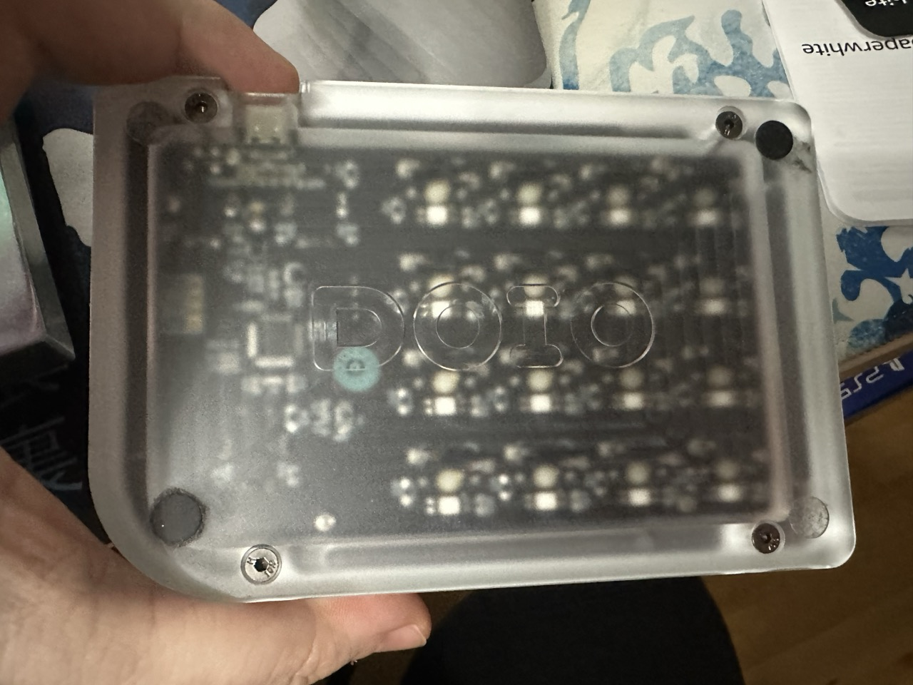

# Megalodon DOIO KB16-01 rev1

<table>
  <tr>
  <td>
    
  </td>
  <td>
    
  </td>
  </tr>
</table>

## VIA Sideloading

Need to use VIA 1.3.1 to map the keys.

<table>
  <tr>
  <th>File</th>
  <th>Description</th>
  </tr>
  <tr>
  <td>
    via-1.3.1--kb16-01-rev1-keymap.json
  </td>
  <td>
    VIA keymap sideloaded JSON file
  </td>
  </tr>
  <tr>
  <td>
    via-1.3.1--kb16-01-rev1-layout.json
  </td>
  <td>
    Macros saved on the layout to manage windows using Rectangles Pro.
  </td>
  </tr>
</table>
