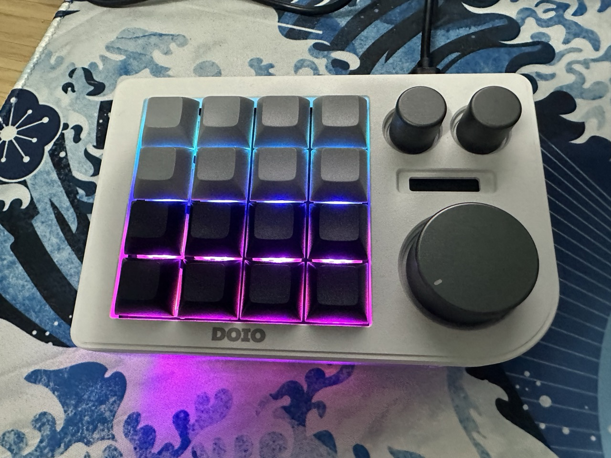
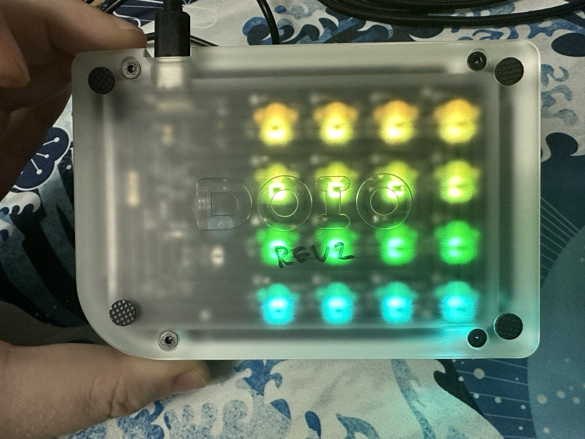

# Megalodon DOIO KB16-01 rev2

## Notes

- MARKED REV2 under the board
- Only works with its own USB-A to USB-C cable.

<table>
  <tr>
  <td>
    
  </td>
  <td>
    
  </td>
  </tr>
</table>

## VIA Sideloading

Need to use VIA 2.2.0 or later to map the keys.

<table>
  <tr>
  <th>File</th>
  <th>Description</th>
  </tr>
  <tr>
  <td>
    via-3.0.0--kb16-01-rev2-keymap.json
  </td>
  <td>
    VIA keymap sideloaded JSON file, use this to load up the keys for mapping.
  </td>
  </tr>
  <tr>
  <td>
    via-3.0.0-kb16-01-rev2-layout.json
  </td>
  <td>
    Macros saved on the layout to manage windows using Rectangles Pro.
  </td>
  </tr>
  <tr>
  <td>
    megalodon_triple_knob_macro_pad.bin
  </td>
  <td>
    QMK Firmware file to flash using QMK Toolbox. This firmware update enables VIA 2.2.0 to be used.
  </td>
  </tr>
  <tr>
  <td>
    QMK.Toolbox.pkg
  </td>
  <td>
    QMK Toolbox binary file for macOS to be use to flash the firmware.
  </td>
  </tr>
</table>
